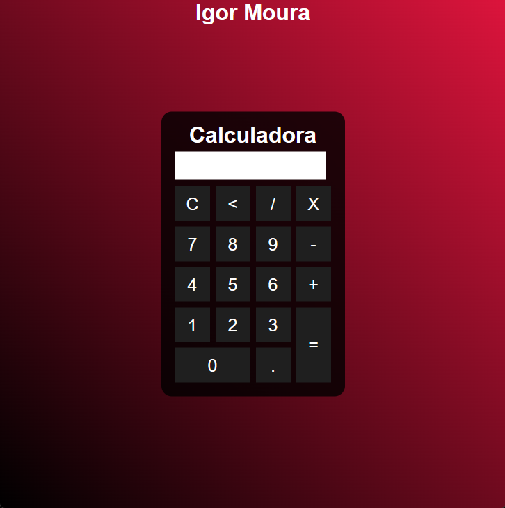

<h1 align="center">CALCULADORA</h1>

> Projeto criado a partir de um [video no youtube](https://www.youtube.com/watch?v=42TShjXR0m0)

## ✔️ Tecnologias utilizadas

- ``HTML``
- ``CSS``
- ``JavaScript``
